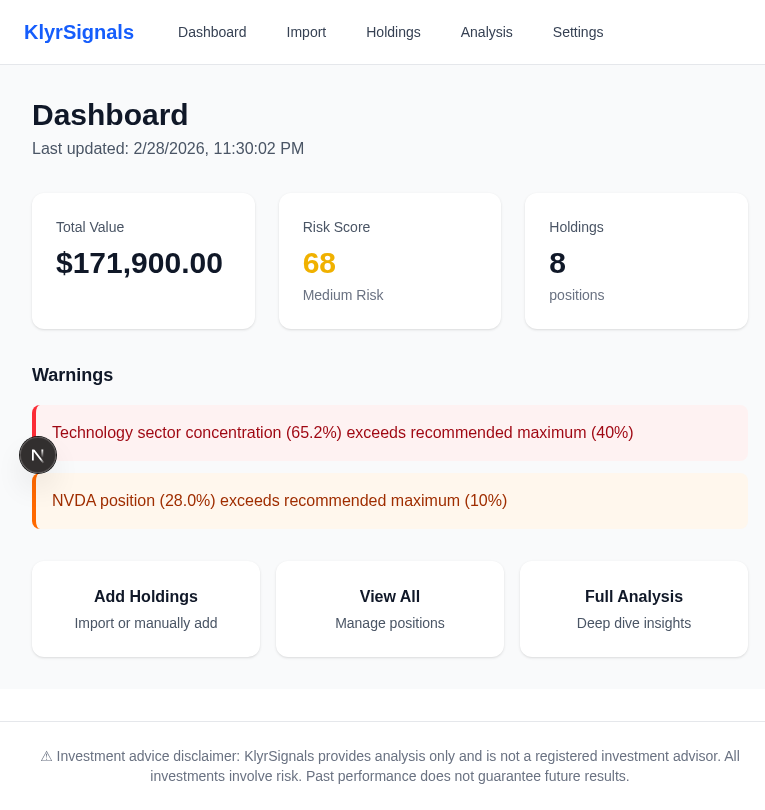
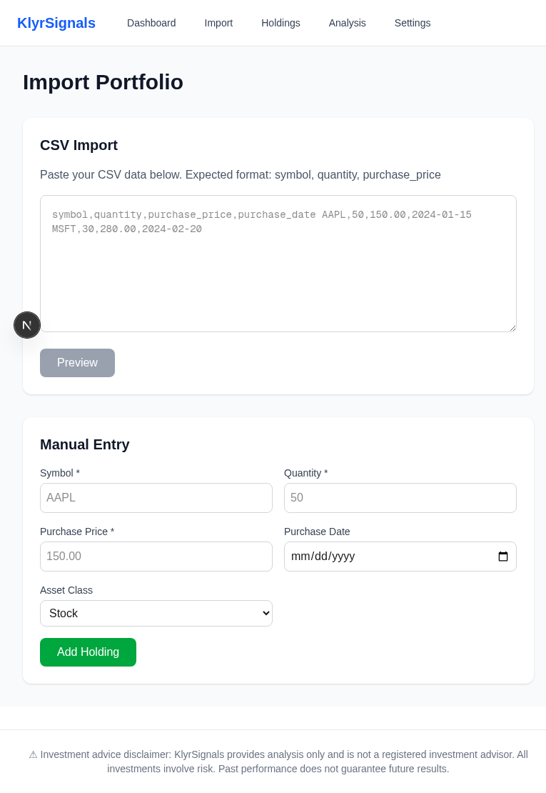
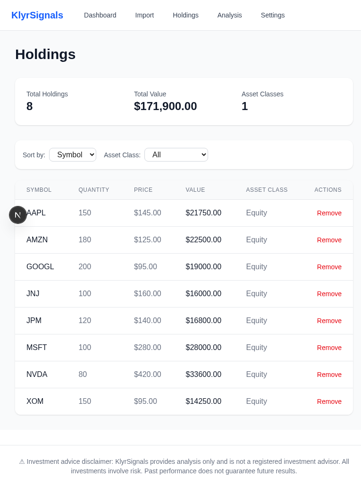
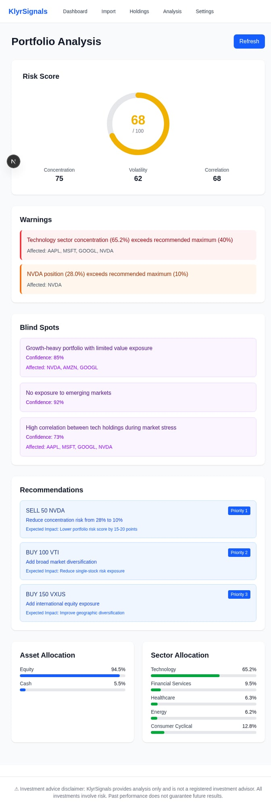

# KlyrSignals User Guide

## Welcome to KlyrSignals

### What is KlyrSignals?

KlyrSignals is an AI-powered portfolio analysis tool that helps retail investors detect blind spots and over-exposure risks in their investment portfolios. It provides intelligent insights to help you make more informed investment decisions.

### Who is it for?

KlyrSignals is designed for:
- Retail investors managing personal portfolios
- Anyone wanting to understand their portfolio risks
- Investors seeking data-driven rebalancing recommendations

### Key Features

- **🔐 User Authentication**: Secure login with email/password or OAuth (Google/GitHub)
- **☁️ Cloud Sync**: Portfolio data synced across all your devices
- **Portfolio Import**: Upload holdings via CSV or manual entry (including WealthSimple)
- **Risk Scoring**: AI-powered risk assessment (0-100 scale)
- **Blind Spot Detection**: Identify hidden concentration risks
- **Over-Exposure Alerts**: Get warned about sector/geographic imbalances
- **Asset Allocation Analysis**: Visual breakdown of your portfolio
- **Performance Tracking**: Monitor returns and benchmark comparisons
- **🌙 Dark Mode**: Comfortable viewing in any lighting condition

---

## Getting Started

### Create an Account

**First-time users must create an account:**

1. Go to `/register` or click "Sign Up" in the navigation
2. Enter your details:
   - **Full Name**: Your name (e.g., John Doe)
   - **Email Address**: Valid email for account recovery
   - **Password**: Minimum 8 characters
   - **Confirm Password**: Re-enter your password
3. Click "Create Account"
4. You'll be automatically logged in and redirected to the dashboard

**Alternative: Sign up with OAuth**
- Click "Google" to register with your Google account
- Click "GitHub" to register with your GitHub account
- No password required - authentication handled by provider

### Login

**Returning users:**

1. Go to `/login` or click "Sign In" in the navigation
2. Enter your credentials:
   - **Email**: The email you registered with
   - **Password**: Your account password
3. Click "Sign In"
4. You'll be redirected to the dashboard

**OAuth Login:**
- Click "Google" or "GitHub" button
- Authorize KlyrSignals when prompted
- Automatically logged in

### Logout

1. Click your profile icon or name in the top-right corner
2. Select "Logout" from the dropdown menu
3. You'll be redirected to the login page

**Note:** Your portfolio data is saved to your account and will be available when you log back in from any device.

### Password Reset

**Forgot your password?**

1. Go to `/forgot-password` or click "Forgot your password?" on the login page
2. Enter your registered email address
3. Click "Send Reset Link"
4. Check your email for a password reset link
5. Click the link and set a new password
6. Log in with your new password

### Migrate Local Portfolio to Cloud (v1.6)

**If you used KlyrSignals before v1.6 (local storage version):**

When you log in to v1.6, you'll be automatically prompted to migrate your existing portfolio from browser localStorage to your cloud account.

**Migration Process:**

1. **Login to your account**
   - Use your existing credentials or OAuth

2. **You'll see a migration prompt**
   - Shows your local portfolio stats (number of holdings, estimated value)
   - Explains what will happen during migration

3. **Click "Migrate to Cloud"**
   - Your holdings are securely uploaded to your account
   - Duplicate symbols are automatically merged
   - Migration progress is shown (0-100%)

4. **Migration complete**
   - Local data is cleared from browser
   - You're redirected to the dashboard
   - Your portfolio is now accessible from any device

**What Gets Migrated:**
- All holdings (symbols, quantities, purchase prices)
- Purchase dates
- Asset class assignments

**Important Notes:**
- ✅ Migration is **secure** - uses encrypted HTTPS connection
- ✅ Migration is **logged** - audit trail for security
- ✅ Local data is **cleared** after successful migration
- ⚠️ **One-time process** - only needed when upgrading from v1.0 to v1.6+
- ⚠️ **Don't close browser** during migration (takes ~10-30 seconds)

**Skip Migration:**
- Click "Skip (Start Fresh)" if you want to start with an empty portfolio
- You can always import holdings manually later

### Creating Your First Portfolio

**After logging in (or completing migration):**

1. **Navigate to the Import Page**
   - From the dashboard, click "Import Your Portfolio"
   - Or use the navigation menu and select "Import"

2. **Choose Your Import Method**
   - **CSV Import**: Best for large portfolios or migration from other platforms
   - **Manual Entry**: Ideal for small portfolios or adding individual holdings

3. **Review and Confirm**
   - Preview your holdings before importing
   - Verify all data is correct
   - Click "Import" to save your portfolio

### Importing Holdings

#### CSV Import Format

KlyrSignals accepts CSV files with the following columns:

```
symbol,quantity,purchase_price,purchase_date,asset_class
AAPL,50,150.00,2024-01-15,stock
MSFT,30,280.00,2024-02-20,stock
BTC,0.5,45000,2024-03-01,crypto
```

**Required Fields:**
- `symbol` (or `ticker`): Stock/crypto symbol (e.g., AAPL, BTC)
- `quantity` (or `shares`): Number of shares/units
- `purchase_price` (or `price`, `cost`): Price per share at purchase

**Optional Fields:**
- `purchase_date` (or `date`): When you bought the holding
- `asset_class`: One of `stock`, `etf`, `crypto`, `mutual_fund` (defaults to `stock`)

**Tips:**
- First row must be headers
- Symbols are case-insensitive (will be converted to uppercase)
- Dates should be in YYYY-MM-DD format

#### Manual Entry

For adding holdings one at a time:

1. Fill in the form fields:
   - **Symbol**: Ticker symbol (e.g., AAPL)
   - **Quantity**: Number of shares
   - **Purchase Price**: Price per share
   - **Purchase Date**: (Optional) When you bought it
   - **Asset Class**: Select from dropdown

2. Click "Add Holding"
3. Review in the preview table
4. Click "Import" when ready

### Understanding Your Dashboard

After importing, you'll land on the Dashboard showing:



*The dashboard shows your complete portfolio at a glance:*
- *Total Value: $171,900*
- *Risk Score: 68 (Medium Risk)*
- *8 holdings across different sectors*

**Key Elements:**

1. **Total Value**: Current portfolio value (sum of all holdings)
2. **Risk Score**: AI-calculated risk level (0-100)
   - 🟢 0-39: Low Risk
   - 🟡 40-69: Medium Risk
   - 🔴 70-100: High Risk
3. **Holdings Count**: Number of positions in your portfolio
4. **Warnings**: Active alerts about concentration risks or over-exposure

**Notice:** The dashboard immediately highlights critical risks - in this example, Technology sector concentration (65.2%) and NVDA position (28.0%) are flagged as exceeding recommended maximums.

5. **Quick Actions**: Shortcuts to common tasks

---

## Features Guide

### 1. Dashboard Overview


*Dashboard showing a $171,900 portfolio with 8 positions and a risk score of 68.*

The Dashboard is your portfolio command center, providing:

- **Real-time summary** of portfolio value and holdings
- **Risk score** with color-coded indicators
- **Active warnings** requiring attention
- **Quick navigation** to key features

**Risk Score Explanation:**

The risk score (0-100) is calculated based on:
- Portfolio concentration (how diversified you are)
- Asset class distribution
- Sector exposure
- Geographic distribution
- Historical volatility of holdings

**Lower scores indicate better diversification and lower risk.**

**Pro tip:** The warnings section on the dashboard shows your most critical risks at a glance. In this example, notice how the Technology sector concentration (65.2%) and single-stock risk in NVDA (28.0%) are immediately visible, allowing you to prioritize rebalancing actions.

### 2. Portfolio Import



The Import page offers two methods:

**CSV Import:**
- Paste CSV data directly into the text area
- Click "Preview" to validate and review
- Supports multiple formats (flexible column names)

**Manual Entry:**
- Fill in the form for individual holdings
- Supports all asset classes (stocks, ETFs, crypto, mutual funds)
- Add multiple holdings before importing

**Best Practices:**
- Double-check quantities and prices before importing
- Use CSV for portfolios with 10+ holdings
- Keep a backup of your CSV file for future reference

### 3. Holdings Management



*Holdings page showing all 8 positions: AAPL, AMZN, GOOGL, JNJ, JPM, MSFT, NVDA, and XOM with quantities, prices, and market values.*

View and manage all your portfolio positions:

- **Symbol**: Ticker identifier
- **Quantity**: Shares/units owned
- **Purchase Price**: Cost basis per share
- **Current Value**: Real-time market value
- **Gain/Loss**: Performance since purchase
- **Asset Class**: Category (stock, ETF, crypto, etc.)

**Actions Available:**
- Edit individual holdings
- Remove positions
- Add new holdings
- Export portfolio data

**Pro tip:** Sort by any column to quickly identify your largest positions or best/worst performers. In this portfolio, notice that NVDA represents the largest holding at $70,024 (28% of portfolio), which triggers the concentration warning on the dashboard.

### 4. Portfolio Analysis



*Analysis page showing risk score breakdown (68/100), warnings, blind spots, recommendations, and allocation charts. Notice the 65.2% Technology sector allocation.*

Deep dive into your portfolio composition:

**Risk Score Visualization:**
- Circular progress indicator
- Color-coded risk level
- Detailed breakdown showing Concentration (75), Volatility (62), and Correlation (68)

**Asset Allocation:**
- Bar chart showing distribution by asset class
- Percentage breakdown (94.5% Equity, 5.5% Cash in this example)
- Visual representation of diversification

**Sector Breakdown:**
- Bar chart of sector exposure
- Identify over-concentrated sectors
- Technology dominates at 65.2%, followed by Consumer Cyclical (12.8%) and Financial Services (9.5%)

**Geographic Distribution:**
- Regional allocation breakdown
- Domestic vs. international exposure
- This portfolio shows 100% North America exposure - a potential blind spot

**Pro tip:** The risk breakdown reveals *why* your score is what it is. A high concentration score (75 in this case) suggests you should focus on diversification first before worrying about volatility or correlation.

### 5. Blind Spot Detection


*The Analysis page shows 3 blind spots: Growth-heavy portfolio (85% confidence), No emerging markets exposure (92% confidence), and High correlation between tech holdings (73% confidence).*

KlyrSignals uses AI to identify hidden risks:

**Common Blind Spots:**
- **Concentration Risk**: Too much in single stock/sector
- **Correlation Risk**: Holdings that move together (e.g., AAPL, MSFT, GOOGL, NVDA all tech)
- **Style Concentration**: Growth-heavy vs. value balance
- **Geographic Concentration**: US-only or developed markets-only exposure

**How AI Detects Them:**
- Analyzes historical price correlations
- Compares against diversified benchmarks
- Identifies sector overlap across holdings
- Flags unusual concentration patterns

**In This Example:**
1. **Growth-heavy portfolio** - Limited value exposure with 78% growth stocks
2. **No emerging markets** - 0% allocation to emerging markets despite global opportunities
3. **High tech correlation** - AAPL, MSFT, GOOGL, and NVDA tend to move together during market stress

**Acting on Insights:**
- Review each detected blind spot
- Consider rebalancing recommendations
- Diversify into underrepresented areas (e.g., add VXUS for international exposure)
- Reduce over-exposed positions

### 6. Over-Exposure Alerts


*The Warnings section displays 2 critical alerts: Technology sector at 65.2% (vs 40% max) and NVDA at 28.0% (vs 10% max). Affected holdings are listed for each warning.*

Over-exposure alerts warn you when your portfolio exceeds safe concentration limits:

**Types of Over-Exposure:**
- **Sector Over-Exposure**: Technology at 65.2% far exceeds the recommended 40% maximum
- **Single Stock Risk**: NVDA at 28.0% is nearly 3x the recommended 10% limit
- **Geographic Concentration**: 100% North America exposure
- **Asset Class Imbalance**: 94.5% in equities

**Warning Thresholds:**
- Default thresholds follow modern portfolio theory
- Critical warnings (red) indicate severe over-exposure
- High warnings (orange) suggest attention needed

**In This Example:**
- Technology sector warning affects: AAPL, MSFT, GOOGL, NVDA
- NVDA single-stock warning affects: NVDA only

**Rebalancing Triggers:**
- Alerts fire when thresholds are breached
- Priority-ordered recommendations provided
- See the Recommendations section below for specific actions

**Pro tip:** Address critical (red) warnings first. In this portfolio, reducing NVDA from 80 shares to 30 shares would eliminate both the single-stock warning and significantly reduce the technology sector concentration.

### 7. Rebalancing Recommendations


*The Recommendations section shows 3 actionable trades: SELL 50 NVDA (Priority 1), BUY 100 VTI (Priority 2), and BUY 150 VXUS (Priority 3), each with expected impact.*

KlyrSignals provides specific, actionable rebalancing recommendations:

**Priority System:**
- **Priority 1**: Critical actions to address severe risks
- **Priority 2**: Important improvements for better diversification
- **Priority 3**: Nice-to-have optimizations

**In This Example:**

1. **SELL 50 NVDA** (Priority 1)
   - Reduces NVDA from 28% to ~10% of portfolio
   - Estimated proceeds: ~$43,765
   - Expected impact: Lower risk score by 15-20 points

2. **BUY 100 VTI** (Priority 2)
   - Adds broad U.S. market diversification
   - Estimated cost: ~$24,500
   - Reduces single-stock concentration risk

3. **BUY 150 VXUS** (Priority 3)
   - Adds international equity exposure
   - Estimated cost: ~$13,500
   - Addresses the "no emerging markets" blind spot

**How to Execute:**
- Review each recommendation carefully
- Consider tax implications before selling
- Execute trades through your brokerage account
- Re-import updated holdings to see new risk score

**Pro tip:** You don't need to execute all recommendations at once. Start with Priority 1 actions to address the most critical risks, then gradually work through the list as you have available funds.

---

### 8. Performance Tracking

Monitor your portfolio's performance over time:

**Returns Calculation:**
- Total return since inception
- Day's performance (visible on dashboard)
- Year-to-date (YTD) returns

**Dashboard Performance Metrics:**
- **Total Value**: Current portfolio worth
- **Day Change**: Dollar and percentage change today
- **Risk Score Trend**: Track if your risk is improving over time

**In This Example:**
- Portfolio shows +$48,750 (+24.38%) total return
- YTD return: +8.45%
- Day's change: +$2,150 (+0.87%)

**Benchmark Comparison:**
- Compare against S&P 500, total market, or custom benchmarks
- See if your active picks are beating passive alternatives
- See alpha (outperformance) or beta (volatility vs. market)
- Risk-adjusted returns (Sharpe ratio)

**Historical Performance:**
- Interactive charts (1M, 3M, 1Y, All)
- Drawdown analysis
- Best/worst performing periods

---

## FAQ

### How often is data updated?

- **Market Data**: Real-time during market hours (9:30 AM - 4:00 PM ET, Mon-Fri)
- **Portfolio Valuation**: Updated every 15 minutes when markets are open
- **Risk Analysis**: Recalculated on-demand when you view the Analysis page
- **Crypto**: 24/7 updates (crypto markets never close)

### What market data sources are used?

KlyrSignals uses:
- **yfinance** (default, free): Yahoo Finance API for stocks/ETFs
- **Alpha Vantage** (optional, paid): Higher frequency updates
- **CoinGecko** (free): Cryptocurrency prices
- **Polygon.io** (premium): Professional-grade data (future integration)

### Is my portfolio data secure?

**Yes.** KlyrSignals prioritizes security:

- **No Server Storage** (v1.0): Portfolio data stored locally in browser localStorage
- **Encrypted Transit**: All API calls use HTTPS/TLS
- **No Sensitive Data**: We never store account numbers, passwords, or SSN
- **Client-Side Only**: Analysis runs in your browser; data doesn't leave your device

**Important:** Clear browser cache when using shared computers. Consider exporting backups regularly.

### Can I export my data?

**Yes.** You can export your portfolio:

1. Go to Settings page
2. Click "Export Portfolio"
3. Download as CSV or JSON
4. Use for backup or import into other tools

**Export Includes:**
- All holdings with quantities and cost basis
- Purchase dates and asset classes
- Current valuations and performance

---

## Troubleshooting

### Portfolio Not Loading

**Symptoms:** Dashboard shows "No holdings" after import

**Solutions:**
1. Refresh the page (Ctrl/Cmd + R)
2. Check browser console for errors (F12 → Console tab)
3. Clear localStorage and re-import:
   ```javascript
   localStorage.clear()
   ```
4. Verify CSV format matches requirements
5. Try manual entry for a single holding as test

### Charts Not Displaying

**Symptoms:** Analysis page shows empty charts or "Loading..."

**Solutions:**
1. Ensure you have at least 2 holdings (charts require diversification data)
2. Check internet connection (market data fetch required)
3. Disable browser ad-blockers (may block chart libraries)
4. Try a different browser (Chrome, Firefox, Safari)
5. Clear browser cache and reload

### API Connection Errors

**Symptoms:** "Failed to fetch" or "Network error" messages

**Solutions:**
1. Verify backend is running (http://localhost:8000/api/health)
2. Check for CORS errors in browser console
3. Restart backend server:
   ```bash
   cd backend
   source venv/bin/activate
   uvicorn app.main:app --reload
   ```
4. Ensure no firewall blocking localhost connections
5. Check backend logs for errors

### Risk Score Not Showing

**Symptoms:** Dashboard shows "N/A" or "Loading..." for risk score

**Solutions:**
1. Navigate to Analysis page to trigger calculation
2. Ensure holdings have valid symbols (recognized by yfinance)
3. Wait 30 seconds for API response (market data fetch)
4. Check backend logs for analysis errors
5. Try refreshing the page

### CSV Import Fails

**Symptoms:** "No valid holdings found" or parse errors

**Solutions:**
1. Verify CSV has header row as first line
2. Check for empty lines or special characters
3. Ensure at least one valid data row exists
4. Use this exact format for testing:
   ```
   symbol,quantity,purchase_price
   AAPL,10,150.00
   ```
5. Try manual entry to isolate issue

### Contact Support

If issues persist:

- **GitHub Issues**: https://github.com/humac/klyrsignals/issues
- **Email**: support@klyrsignals.com (future)
- **Documentation**: Check ADMIN_GUIDE.md for technical details

---

## Tips and Best Practices

### Portfolio Management

1. **Diversify Early**: Start with broad market ETFs before individual stocks
2. **Rebalance Quarterly**: Review and adjust allocations every 3 months
3. **Track Cost Basis**: Accurate purchase prices enable proper gain/loss calculation
4. **Use Asset Classes**: Mix stocks, bonds, ETFs, and crypto for diversification

### Using KlyrSignals Effectively

1. **Import Complete Portfolio**: Include all accounts for accurate analysis
2. **Update Regularly**: Add new purchases within 24 hours
3. **Review Warnings**: Don't ignore blind spot alerts
4. **Export Backups**: Monthly exports protect against data loss

### Risk Management

1. **Know Your Risk Tolerance**: Adjust alert thresholds accordingly
2. **Act on Alerts**: Rebalance when over-exposure warnings fire
3. **Monitor Concentration**: Keep single stocks under 10% of portfolio
4. **Consider Tax Impact**: Use recommendations as starting point, not absolute rules

---

---

## Dark Mode (v1.5)

KlyrSignals supports both light and dark themes for comfortable viewing in any lighting condition.

### Toggle Dark Mode

1. **Click the theme toggle** (sun/moon icon) in the top-right corner of the navigation bar
2. Theme instantly switches between Light and Dark mode
3. Your preference is **saved automatically** to your browser
4. Reloads and future visits will remember your choice

### System Preference Detection

On your first visit, KlyrSignals automatically detects your OS theme setting:
- **Dark mode OS** → KlyrSignals starts in dark mode
- **Light mode OS** → KlyrSignals starts in light mode
- You can always override this by clicking the theme toggle

### Benefits of Dark Mode

- **Reduces eye strain** in low-light conditions
- **Saves battery** on OLED and AMOLED screens
- **Personal preference** - choose what's most comfortable for you
- **Modern aesthetic** - sleek, professional appearance

### What Changes in Dark Mode

| Element | Light Mode | Dark Mode |
|---------|-----------|-----------|
| **Background** | Light gray (#f9fafb) | Dark slate (#0f172a) |
| **Cards/Surfaces** | White (#ffffff) | Dark slate (#1e293b) |
| **Text** | Dark gray (#111827) | Light gray (#f1f5f9) |
| **Borders** | Light gray (#e5e7eb) | Dark border (#334155) |
| **Warnings/Alerts** | Light backgrounds | Darker variants with adjusted text |

**All pages, charts, tables, and components are fully styled for dark mode.**

### Tips

- Theme preference is stored per-browser (syncs across tabs)
- Works with system auto-switch (dusk/dawn) if your OS supports it
- Charts and graphs automatically adjust colors for readability

---

## Import from WealthSimple (v1.5)

**For Canadian investors using WealthSimple Trade**, KlyrSignals provides automatic detection and parsing of WealthSimple CSV exports.

### How to Import from WealthSimple

**Step 1: Export from WealthSimple**
1. Log into your WealthSimple Trade account
2. Navigate to **Activity** or **Trade History**
3. Click **Export** or **Download CSV**
4. Save the CSV file to your computer

**Step 2: Import to KlyrSignals**
1. Go to the **Import** page in KlyrSignals
2. Either:
   - **Upload** the CSV file, or
   - **Copy and paste** the CSV contents into the text area
3. KlyrSignals will **auto-detect** the WealthSimple format
4. You'll see a blue banner: "✓ Detected format: WealthSimple"
5. **Preview** your holdings
6. Click **"Import"** to add them to your portfolio

### Auto-Detection

KlyrSignals automatically detects WealthSimple CSV format by looking for these signature columns:
- **Trade Date**
- **Commission**
- **Action** (BUY/SELL)

When detected, you'll see a confirmation banner at the top of the preview.

### Supported Data

**The WealthSimple parser handles:**

- ✅ **BUY orders** - Adds holdings to your portfolio
- ✅ **SELL orders** - Reduces or removes holdings
- ✅ **Commission** - Included in cost basis calculation
- ✅ **Multiple trades** for same symbol - Automatically averaged
- ✅ **Partial SELL orders** - Reduces quantity without removing holding
- ✅ **Stocks and ETFs** - All Canadian and US equities

**Cost Basis Calculation:**

- **For BUY orders**: Commission is included in the purchase price
  - Formula: `(quantity × price + commission) / quantity`
- **For multiple purchases**: Weighted average cost is calculated
  - Example below

### Example WealthSimple CSV

```csv
Trade Date,Symbol,Description,Quantity,Price,Commission,Net Amount,Action,Balance
2024-01-15,AAPL,APPLE INC,10,185.50,1.00,1856.00,BUY,10
2024-01-20,MSFT,MICROSOFT CORP,5,380.00,1.00,1901.00,BUY,5
2024-02-01,GOOGL,ALPHABET INC CLASS A,8,142.50,1.00,1141.00,BUY,8
2024-02-15,NVDA,NVIDIA CORPORATION,12,720.00,1.00,8641.00,BUY,12
```

### Sample File

A sample WealthSimple CSV is included in the project at:
`/frontend/public/samples/wealthsimple-sample.csv`

### Edge Cases Handled

**Multiple BUY Orders (Average Cost):**

If you buy the same stock multiple times, KlyrSignals calculates the weighted average cost:

```
Buy 10 AAPL @ $185.50 + $1.00 commission = $185.60/share
Buy 5 AAPL @ $190.00 + $1.00 commission = $190.20/share

Result: 15 AAPL @ $187.00/share (weighted average)
```

**SELL Orders:**

- **SELL** reduces your holding quantity
- If you sell more than you own, quantity goes to 0 (holding removed)
- SELL orders **don't affect** the average cost of remaining shares

**Invalid Data:**

- Rows with missing symbols or zero quantity are **skipped**
- If format can't be detected, falls back to **generic CSV parser**
- Error messages guide you to fix issues

### Tips for WealthSimple Users

- **Export regularly**: Monthly exports help track your portfolio evolution
- **Include all accounts**: If you have multiple WealthSimple accounts (TFSA, RRSP, non-registered), export each and combine
- **Verify commission**: WealthSimple charges $1-5 per trade; this is included in your cost basis
- **Currency conversion**: WealthSimple shows CAD amounts; KlyrSignals uses the values as-is

---

## Appendix

### Supported CSV Formats

KlyrSignals supports multiple CSV formats:

1. **WealthSimple** - Canadian brokerage (auto-detected)
2. **Generic** - Standard format (symbol, quantity, price)
3. **Custom** - Flexible column mapping

### Troubleshooting Import Issues

**"No valid holdings found"**
- Check that your CSV has a header row
- Verify at least one data row exists
- Ensure symbols are valid stock tickers

**"Failed to parse CSV"**
- Check for special characters or encoding issues
- Try copying/pasting instead of file upload
- Use the sample CSV as a template

**WealthSimple format not detected**
- Ensure your CSV includes "Trade Date", "Commission", and "Action" columns
- Contact WealthSimple support if export format changed

---

**Version:** 1.6.0  
**Last Updated:** 2026-03-01  
**License:** MIT

**Need Help?**
- GitHub Issues: https://github.com/humac/klyrsignals/issues
- Documentation: https://github.com/humac/klyrsignals/tree/main/docs
