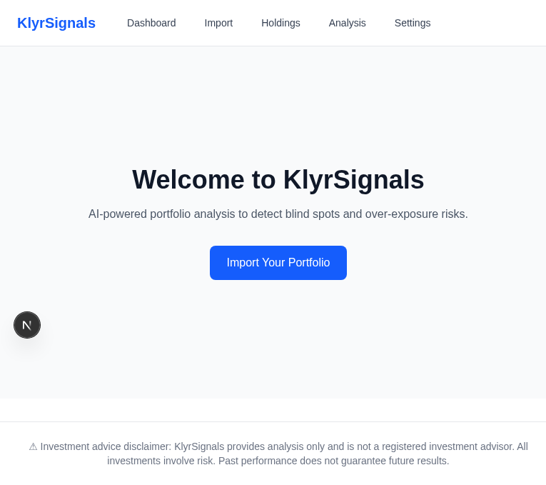
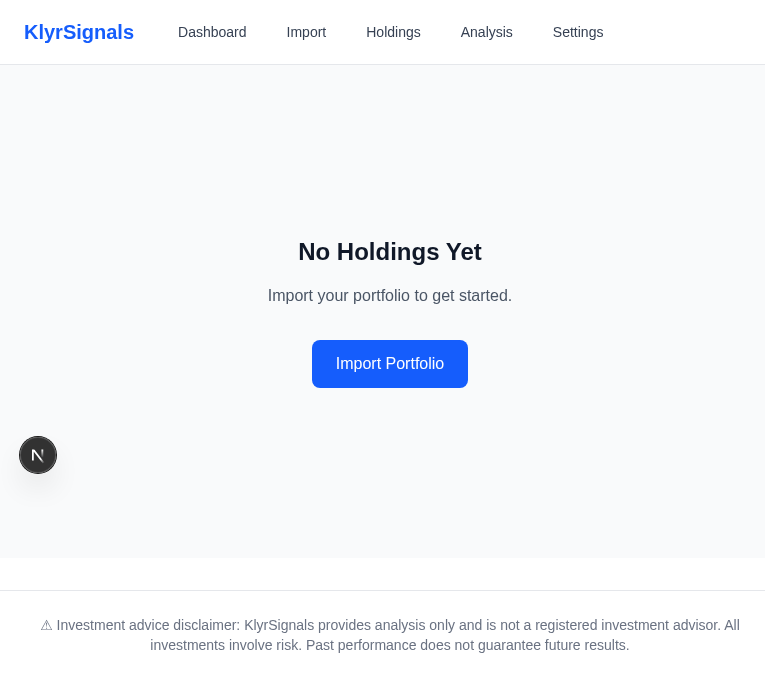
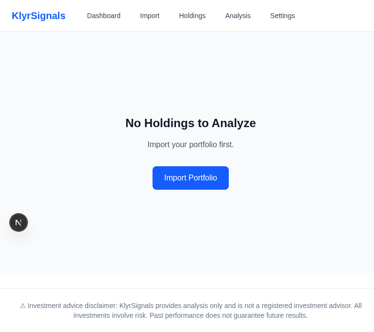
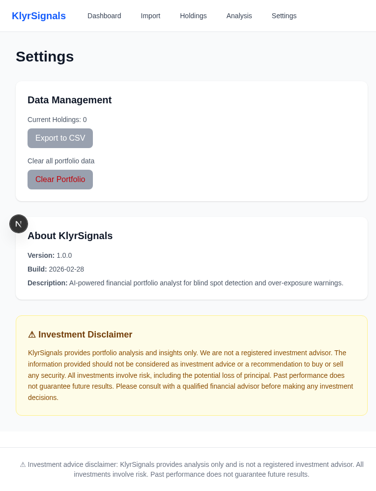

# KlyrSignals User Guide

## Welcome to KlyrSignals

### What is KlyrSignals?

KlyrSignals is an AI-powered portfolio analysis tool that helps retail investors detect blind spots and over-exposure risks in their investment portfolios. It provides intelligent insights to help you make more informed investment decisions.

### Who is it for?

KlyrSignals is designed for:
- Retail investors managing personal portfolios
- Anyone wanting to understand their portfolio risks
- Investors seeking data-driven rebalancing recommendations

### Key Features

- **Portfolio Import**: Upload holdings via CSV or manual entry
- **Risk Scoring**: AI-powered risk assessment (0-100 scale)
- **Blind Spot Detection**: Identify hidden concentration risks
- **Over-Exposure Alerts**: Get warned about sector/geographic imbalances
- **Asset Allocation Analysis**: Visual breakdown of your portfolio
- **Performance Tracking**: Monitor returns and benchmark comparisons

---

## Getting Started

### Creating Your First Portfolio

1. **Navigate to the Import Page**
   - From the homepage, click "Import Your Portfolio"
   - Or use the navigation menu and select "Import"

2. **Choose Your Import Method**
   - **CSV Import**: Best for large portfolios or migration from other platforms
   - **Manual Entry**: Ideal for small portfolios or adding individual holdings

3. **Review and Confirm**
   - Preview your holdings before importing
   - Verify all data is correct
   - Click "Import" to save your portfolio

### Importing Holdings

#### CSV Import Format

KlyrSignals accepts CSV files with the following columns:

```
symbol,quantity,purchase_price,purchase_date,asset_class
AAPL,50,150.00,2024-01-15,stock
MSFT,30,280.00,2024-02-20,stock
BTC,0.5,45000,2024-03-01,crypto
```

**Required Fields:**
- `symbol` (or `ticker`): Stock/crypto symbol (e.g., AAPL, BTC)
- `quantity` (or `shares`): Number of shares/units
- `purchase_price` (or `price`, `cost`): Price per share at purchase

**Optional Fields:**
- `purchase_date` (or `date`): When you bought the holding
- `asset_class`: One of `stock`, `etf`, `crypto`, `mutual_fund` (defaults to `stock`)

**Tips:**
- First row must be headers
- Symbols are case-insensitive (will be converted to uppercase)
- Dates should be in YYYY-MM-DD format

#### Manual Entry

For adding holdings one at a time:

1. Fill in the form fields:
   - **Symbol**: Ticker symbol (e.g., AAPL)
   - **Quantity**: Number of shares
   - **Purchase Price**: Price per share
   - **Purchase Date**: (Optional) When you bought it
   - **Asset Class**: Select from dropdown

2. Click "Add Holding"
3. Review in the preview table
4. Click "Import" when ready

### Understanding Your Dashboard

After importing, you'll land on the Dashboard showing:



**Key Elements:**

1. **Total Value**: Current portfolio value (sum of all holdings)
2. **Risk Score**: AI-calculated risk level (0-100)
   - 🟢 0-39: Low Risk
   - 🟡 40-69: Medium Risk
   - 🔴 70-100: High Risk
3. **Holdings Count**: Number of positions in your portfolio
4. **Warnings**: Active alerts about concentration risks or over-exposure
5. **Quick Actions**: Shortcuts to common tasks

---

## Features Guide

### 1. Dashboard Overview


The Dashboard is your portfolio command center, providing:

- **Real-time summary** of portfolio value and holdings
- **Risk score** with color-coded indicators
- **Active warnings** requiring attention
- **Quick navigation** to key features

**Risk Score Explanation:**

The risk score (0-100) is calculated based on:
- Portfolio concentration (how diversified you are)
- Asset class distribution
- Sector exposure
- Geographic distribution
- Historical volatility of holdings

**Lower scores indicate better diversification and lower risk.**

### 2. Portfolio Import


The Import page offers two methods:

**CSV Import:**
- Paste CSV data directly into the text area
- Click "Preview" to validate and review
- Supports multiple formats (flexible column names)

**Manual Entry:**
- Fill in the form for individual holdings
- Supports all asset classes (stocks, ETFs, crypto, mutual funds)
- Add multiple holdings before importing

**Best Practices:**
- Double-check quantities and prices before importing
- Use CSV for portfolios with 10+ holdings
- Keep a backup of your CSV file for future reference

### 3. Holdings Management



View and manage all your portfolio positions:

- **Symbol**: Ticker identifier
- **Quantity**: Shares/units owned
- **Purchase Price**: Cost basis per share
- **Current Value**: Real-time market value
- **Gain/Loss**: Performance since purchase
- **Asset Class**: Category (stock, ETF, crypto, etc.)

**Actions Available:**
- Edit individual holdings
- Remove positions
- Add new holdings
- Export portfolio data

### 4. Portfolio Analysis



Deep dive into your portfolio composition:

**Risk Score Visualization:**
- Circular progress indicator
- Color-coded risk level
- Detailed breakdown on hover/click

**Asset Allocation:**
- Pie chart showing distribution by asset class
- Percentage breakdown
- Visual representation of diversification

**Sector Breakdown:**
- Bar chart of sector exposure
- Identify over-concentrated sectors
- Compare against benchmark allocations

**Geographic Distribution:**
- Regional allocation breakdown
- Domestic vs. international exposure
- Emerging markets percentage

### 5. Blind Spot Detection

KlyrSignals uses AI to identify hidden risks:

**Common Blind Spots:**
- **Concentration Risk**: Too much in single stock/sector
- **Correlation Risk**: Holdings that move together
- **Liquidity Risk**: Hard-to-sell positions
- **Currency Risk**: Unhedged foreign exposure

**How AI Detects Them:**
- Analyzes historical price correlations
- Compares against diversified benchmarks
- Identifies sector overlap across holdings
- Flags unusual concentration patterns

**Acting on Insights:**
- Review each detected blind spot
- Consider rebalancing recommendations
- Diversify into underrepresented areas
- Reduce over-exposed positions

### 6. Over-Exposure Alerts



Configure alert thresholds and monitor exposures:

**Types of Over-Exposure:**
- **Sector Over-Exposure**: >25% in single sector
- **Geographic Concentration**: >40% in single region
- **Asset Class Imbalance**: >50% in one asset class
- **Single Stock Risk**: >10% in individual stock

**Warning Thresholds:**
- Customize sensitivity in Settings
- Default thresholds follow modern portfolio theory
- Adjust based on your risk tolerance

**Rebalancing Triggers:**
- Alerts fire when thresholds are breached
- Priority-ordered recommendations provided
- Tax impact estimates included

### 7. Performance Tracking

Monitor your portfolio's performance over time:

**Returns Calculation:**
- Time-weighted returns
- Dollar-weighted returns (IRR)
- Since-inception performance

**Benchmark Comparison:**
- Compare against S&P 500, total market, or custom benchmarks
- See alpha (outperformance) or beta (volatility vs. market)
- Risk-adjusted returns (Sharpe ratio)

**Historical Performance:**
- Interactive charts (1M, 3M, 1Y, All)
- Drawdown analysis
- Best/worst performing periods

---

## FAQ

### How often is data updated?

- **Market Data**: Real-time during market hours (9:30 AM - 4:00 PM ET, Mon-Fri)
- **Portfolio Valuation**: Updated every 15 minutes when markets are open
- **Risk Analysis**: Recalculated on-demand when you view the Analysis page
- **Crypto**: 24/7 updates (crypto markets never close)

### What market data sources are used?

KlyrSignals uses:
- **yfinance** (default, free): Yahoo Finance API for stocks/ETFs
- **Alpha Vantage** (optional, paid): Higher frequency updates
- **CoinGecko** (free): Cryptocurrency prices
- **Polygon.io** (premium): Professional-grade data (future integration)

### Is my portfolio data secure?

**Yes.** KlyrSignals prioritizes security:

- **No Server Storage** (v1.0): Portfolio data stored locally in browser localStorage
- **Encrypted Transit**: All API calls use HTTPS/TLS
- **No Sensitive Data**: We never store account numbers, passwords, or SSN
- **Client-Side Only**: Analysis runs in your browser; data doesn't leave your device

**Important:** Clear browser cache when using shared computers. Consider exporting backups regularly.

### Can I export my data?

**Yes.** You can export your portfolio:

1. Go to Settings page
2. Click "Export Portfolio"
3. Download as CSV or JSON
4. Use for backup or import into other tools

**Export Includes:**
- All holdings with quantities and cost basis
- Purchase dates and asset classes
- Current valuations and performance

---

## Troubleshooting

### Portfolio Not Loading

**Symptoms:** Dashboard shows "No holdings" after import

**Solutions:**
1. Refresh the page (Ctrl/Cmd + R)
2. Check browser console for errors (F12 → Console tab)
3. Clear localStorage and re-import:
   ```javascript
   localStorage.clear()
   ```
4. Verify CSV format matches requirements
5. Try manual entry for a single holding as test

### Charts Not Displaying

**Symptoms:** Analysis page shows empty charts or "Loading..."

**Solutions:**
1. Ensure you have at least 2 holdings (charts require diversification data)
2. Check internet connection (market data fetch required)
3. Disable browser ad-blockers (may block chart libraries)
4. Try a different browser (Chrome, Firefox, Safari)
5. Clear browser cache and reload

### API Connection Errors

**Symptoms:** "Failed to fetch" or "Network error" messages

**Solutions:**
1. Verify backend is running (http://localhost:8000/api/health)
2. Check for CORS errors in browser console
3. Restart backend server:
   ```bash
   cd backend
   source venv/bin/activate
   uvicorn app.main:app --reload
   ```
4. Ensure no firewall blocking localhost connections
5. Check backend logs for errors

### Risk Score Not Showing

**Symptoms:** Dashboard shows "N/A" or "Loading..." for risk score

**Solutions:**
1. Navigate to Analysis page to trigger calculation
2. Ensure holdings have valid symbols (recognized by yfinance)
3. Wait 30 seconds for API response (market data fetch)
4. Check backend logs for analysis errors
5. Try refreshing the page

### CSV Import Fails

**Symptoms:** "No valid holdings found" or parse errors

**Solutions:**
1. Verify CSV has header row as first line
2. Check for empty lines or special characters
3. Ensure at least one valid data row exists
4. Use this exact format for testing:
   ```
   symbol,quantity,purchase_price
   AAPL,10,150.00
   ```
5. Try manual entry to isolate issue

### Contact Support

If issues persist:

- **GitHub Issues**: https://github.com/humac/klyrsignals/issues
- **Email**: support@klyrsignals.com (future)
- **Documentation**: Check ADMIN_GUIDE.md for technical details

---

## Tips and Best Practices

### Portfolio Management

1. **Diversify Early**: Start with broad market ETFs before individual stocks
2. **Rebalance Quarterly**: Review and adjust allocations every 3 months
3. **Track Cost Basis**: Accurate purchase prices enable proper gain/loss calculation
4. **Use Asset Classes**: Mix stocks, bonds, ETFs, and crypto for diversification

### Using KlyrSignals Effectively

1. **Import Complete Portfolio**: Include all accounts for accurate analysis
2. **Update Regularly**: Add new purchases within 24 hours
3. **Review Warnings**: Don't ignore blind spot alerts
4. **Export Backups**: Monthly exports protect against data loss

### Risk Management

1. **Know Your Risk Tolerance**: Adjust alert thresholds accordingly
2. **Act on Alerts**: Rebalance when over-exposure warnings fire
3. **Monitor Concentration**: Keep single stocks under 10% of portfolio
4. **Consider Tax Impact**: Use recommendations as starting point, not absolute rules

---

**Version:** 1.0.0  
**Last Updated:** 2026-02-28  
**License:** MIT
